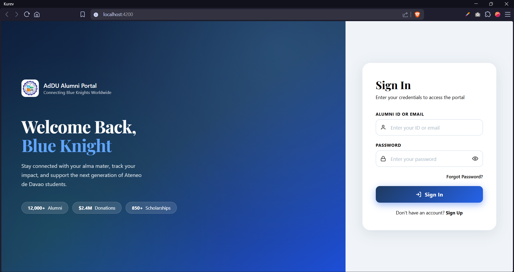
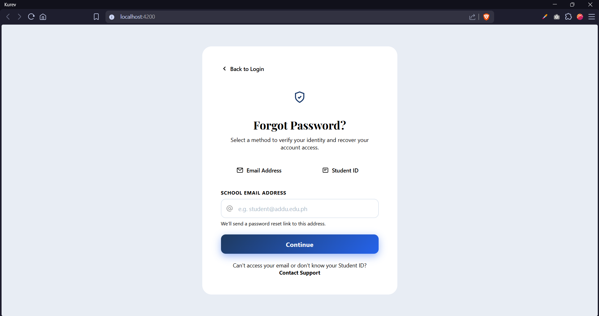
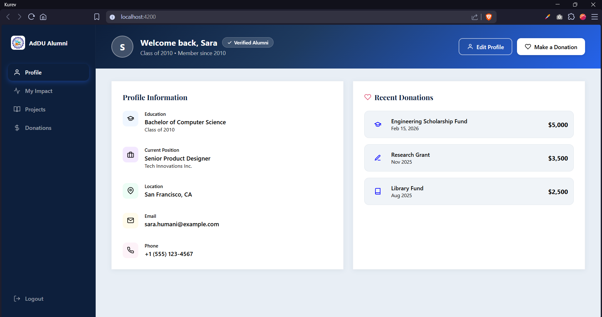
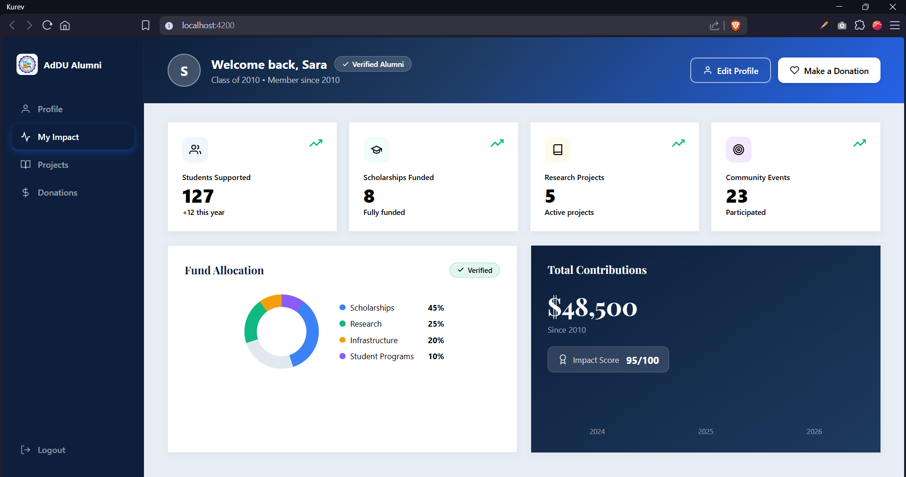
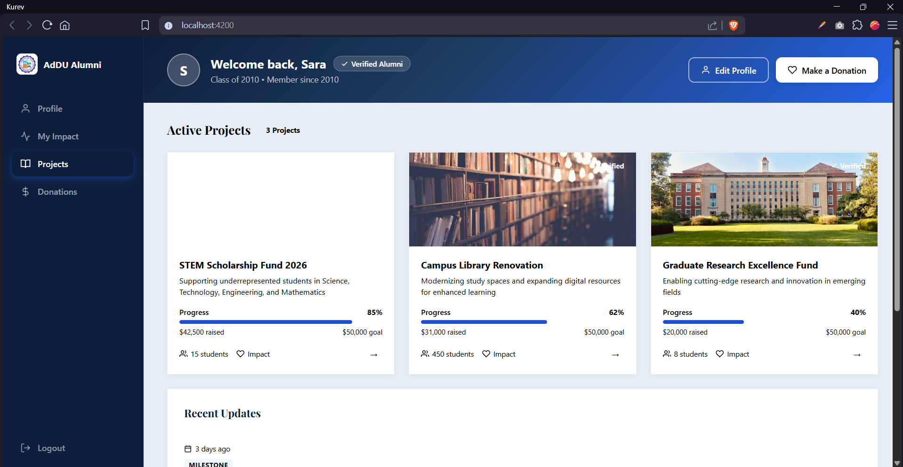
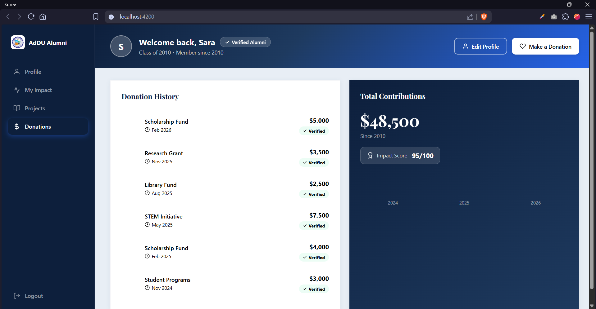

# Montes

**Framework:** Angular
**Module:** Authentication UI (Login & Forgot Password) + Alumni Dashboard

---

## Installation

A step-by-step guide to replicate this project and run it on a different computer.

### Prerequisites

Make sure the following are installed on your machine:

- [Node.js v18 or higher](https://nodejs.org) — required to run Angular
- [Git](https://git-scm.com) — required to clone the repository

### Steps

1. **Install Angular CLI globally**
   ```bash
   npm install -g @angular/cli
   ```

2. **Clone this repository**
   ```bash
   git clone https://github.com/YOUR_USERNAME/YOUR_REPO_NAME.git
   ```

3. **Navigate into the project folder**
   ```bash
   cd YOUR_REPO_NAME
   ```

4. **Install project dependencies**
   ```bash
   npm install
   ```

5. **Run the development server**
   ```bash
   ng serve
   ```

6. **Open the app in your browser**
   ```
   http://localhost:4200
   ```

---

## AI Tools Used

- **Claude (Anthropic)** — used for generating Angular component code, CSS styling, and README structure

---

## Prompt

> "Replicate the attached mobile UI screens (Login + Forgot Password) as Angular components with pixel-accurate fidelity to the original design — same layout, typography weight, color palette (navy #1a3a6b, light gray background, white cards), input field styling, button shapes, and tab switcher. Use a placeholder SVG badge as the logo. Provide the full Angular project setup walkthrough (Node.js → Angular CLI → component files) alongside the complete source code."

---

## Screenshots

### Login Page


### Forgot Password Page


### Dashboard – Profile


### Dashboard – My Impact


### Dashboard – Projects


### Dashboard – Donations
